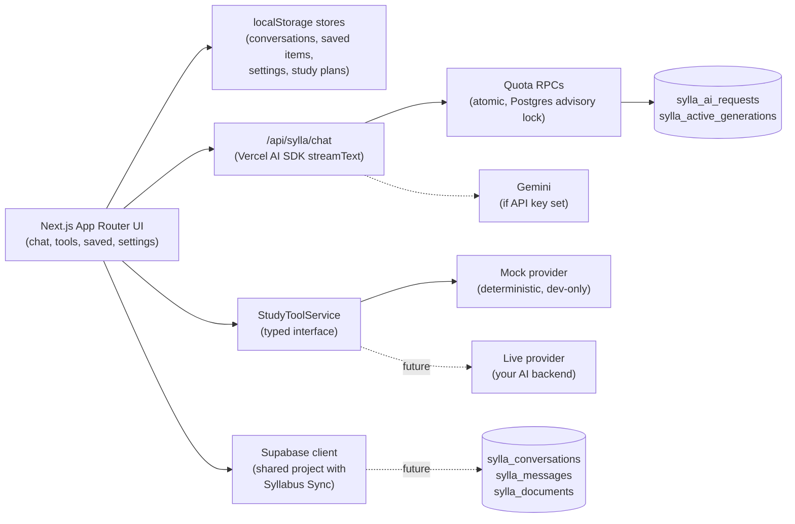

<div align="center">

# Sylla

**Sylla — the AI study assistant for Syllabus Sync.**

Sylla helps turn your units, notes, and study goals into summaries, flashcards, quizzes, and study plans — one account, one design language, one ecosystem with [Syllabus Sync](https://www.syllabus-sync.app).

[](https://nextjs.org)
[](https://react.dev)
[](https://www.typescriptlang.org)
[](https://tailwindcss.com)
[](https://supabase.com)
[](https://sdk.vercel.ai)
[](https://vitest.dev)

[Syllabus Sync](https://www.syllabus-sync.app) · [Architecture](docs/sylla-architecture.md) · [API integration guide](docs/api-integration.md) · Live demo — planned at `sylla.syllabus-sync.app`

</div>

<br/>

> Sylla is an **independent, student-built assistant** and is **not an official Macquarie University service**. It never presents invented university data as real, and is designed to flag uncertainty instead of guessing.

## What is Sylla?

University course material is scattered and dense — lecture slides, readings, assignment briefs — and turning it into something you can actually study from takes time. Sylla is a focused AI study assistant that does that translation work: chat about your material, get it summarised, have a concept explained at the right depth, generate flashcards and practice quizzes, or turn a goal and a deadline into a scheduled plan.

It's the AI module of the Syllabus Sync ecosystem: it shares the same Supabase project and user accounts, mirrors the Syllabus Sync (Macquarie-palette) design system, and its sign-in flow IS Syllabus Sync's login. A future phase embeds the same chat core directly inside the main platform as an assistant panel (see [Architecture](#architecture)).

**Who it's for:** university students who want a lightweight study companion without switching between five different tools — and, as a portfolio piece, an example of building a typed, testable product foundation with a clean seam for swapping in a real AI backend later.

## Current MVP features

| Area | What works today |
| --- | --- |
| **AI chat** | Streaming conversations at `/chat`, markdown/code/table rendering, local conversation history with rename & delete, copy message, edit-and-resend, regenerate, stop-generation, and an anonymous 3-message preview that gates to a Syllabus Sync sign-in CTA. |
| **Study tools** | Five focused tools at `/tools`: **Summarise**, **Explain a concept**, **Flashcards**, **Quiz & practice questions**, and a **Study planner** — each with input validation, loading/empty/error states, and copy/save actions. |
| **Unit context** | Pick a unit from the sidebar so Sylla knows what you're studying. Uses clearly-labelled **sample unit data** for now — real Syllabus Sync units are a planned integration. |
| **Saved items** | Keep chat messages, summaries, flashcard decks, quizzes, and study plans; filter, view, and delete them from `/saved`. |
| **Settings & preferences** | Theme (system/light/dark), chat behaviour (send-on-Enter), default response style, explanation depth, flashcard/quiz counts, and a developer switch to test mock success/slow/empty/error scenarios. |
| **Local persistence** | Conversations, saved items, study plans, and preferences persist in the browser via versioned `localStorage` stores — no account required to use the app. |
| **Shared Syllabus Sync auth (awareness)** | Sylla reads the same Supabase project as Syllabus Sync, so a signed-in session is recognised and lifts the anonymous chat limit. Full cross-app session sharing (shared cookie domain) is a **planned** deployment step — see [Architecture](#architecture). |

## AI status

Sylla is fully usable **with no API key** — every mock path is real, deterministic, and clearly labelled in the UI, so the whole product can be demoed end-to-end before any model is connected.

- **Chat** (`/api/sylla/chat`) uses Google Gemini **only if `GOOGLE_GENERATIVE_AI_API_KEY` is set**. Without it, the endpoint streams a canned mock reply through the same streaming protocol, and the UI shows a "Mock AI mode" banner.
- **Every chat request is rate-limited and quota-enforced server-side** — anonymous and signed-in users get different daily/monthly/per-minute allowances, message-length caps, and output-token caps, atomically reserved in Postgres so concurrent requests can't bypass a limit. Authenticated users can attach one PDF/`.txt` file per message (2 uploads/day). See **[docs/quota-and-cost-control.md](docs/quota-and-cost-control.md)** for the exact numbers, required env vars, and how this was verified against a real Postgres instance.
- **Study tools** currently run on a deterministic **mock provider** (`lib/sylla/ai/mock-provider.ts`) — every result is badged **"Mock AI mode"** in the UI. There is no live model call behind summarise/explain/flashcards/quiz/planner yet, and no server-side quota on them (they don't call Gemini).
- **No RAG or real course-data retrieval exists yet.** These are intentionally out of scope for this phase — see [Roadmap](#roadmap).
- The exact interface and integration point for connecting a real AI provider to the study tools is documented in **[docs/api-integration.md](docs/api-integration.md)** — swapping in a live provider is a one-file change, not a UI rewrite.

## Architecture



- **Next.js App Router** for routing, layouts, and the chat/status API routes.
- **React components**, organised by concern: `components/shell` (app chrome), `components/chat` (chat core), `components/tools` (study tools), `components/ui` (shared primitives).
- **Vercel AI SDK** (`streamText` / `useChat`) powers the chat streaming protocol, used identically whether the reply comes from Gemini or the mock stream.
- **`StudyToolService`** (`lib/sylla/ai/`) is the API boundary for study tools — a typed interface with one mock implementation today, ready for a live implementation to be swapped in.
- **Supabase** (`@supabase/ssr`) client/server setup is shared with Syllabus Sync's project, so user identity is unified even though persistence isn't yet.
- **localStorage stores** (`lib/sylla/store.ts` + `lib/sylla/stores/`) are the current persistence layer — versioned, SSR-safe, and designed to be swapped for Supabase-backed persistence without changing the components that use them.

Full dual-mode (standalone + future embedded) architecture, the shared-auth deployment plan, and the future database schema are documented in **[docs/sylla-architecture.md](docs/sylla-architecture.md)**.

## Getting started

```bash
npm install
cp .env.example .env.local   # every value below is optional for local dev
npm run dev                  # http://localhost:3000
```

| Command | Purpose |
| --- | --- |
| `npm run dev` | Start the development server |
| `npm run lint` | ESLint |
| `npm run typecheck` | TypeScript (`tsc --noEmit`) |
| `npm test` | Vitest suite |
| `npm run build` | Production build |

### Environment variables

Every variable is optional — Sylla runs fully in demo/mock mode with none of them set.

| Variable | Required? | Exposure | Effect when missing |
| --- | --- | --- | --- |
| `NEXT_PUBLIC_SUPABASE_URL` | Optional | Public (browser-safe) | No Supabase session awareness — every visitor is treated as anonymous. |
| `NEXT_PUBLIC_SUPABASE_ANON_KEY` | Optional | Public (browser-safe) | Same as above. |
| `GOOGLE_GENERATIVE_AI_API_KEY` | Optional | **Server-only — never expose with `NEXT_PUBLIC_`** | Chat streams a labelled mock reply instead of a real Gemini response. |
| `GEMINI_MODEL` | Optional | Server-only | Defaults to `gemini-3.5-flash-lite`. Never client-selectable. |
| `SUPABASE_SERVICE_ROLE_KEY` | **Required for quota enforcement** | **Server-only — never expose with `NEXT_PUBLIC_`** | Without it, all rate limits/quotas are skipped (loudly logged) — do not run a real Gemini key in production without this set. See [docs/quota-and-cost-control.md](docs/quota-and-cost-control.md). |
| `SYLLA_IP_HASH_SALT` | Recommended | Server-only | Without it, anonymous rate limiting relies on the cookie alone (easier to bypass by clearing cookies). |
| `NEXT_PUBLIC_SYLLABUS_SYNC_URL` | Optional | Public (browser-safe) | Sign-in CTA falls back to the production Syllabus Sync URL. |
| `NEXT_PUBLIC_AUTH_COOKIE_DOMAIN` | Production only | Public (browser-safe) | Host-only auth cookies — sessions aren't shared across the `syllabus-sync.app` subdomains. |
| `NEXT_PUBLIC_SYLLA_URL` | Optional | Public (browser-safe) | Only used for redirect/deployment documentation. |

Copy `NEXT_PUBLIC_SUPABASE_URL` / `NEXT_PUBLIC_SUPABASE_ANON_KEY` from your Syllabus Sync `.env.local` — the variable names are intentionally identical so the two apps can share one Supabase project.

## Screenshots

<!-- TODO: add screenshots and embed them here — home, chat, study tools, saved items, settings, and a mobile/responsive view. -->

No screenshots yet. Run `npm run dev` and visit `/`, `/chat`, `/tools`, `/saved`, and `/settings` to see the app; a mobile viewport (~375px) exercises the bottom-tab layout.

## Roadmap

**Phase 1 — connect the real backend**
- Improve chat prompt quality and conversation handling
- Connect a real AI provider to the study tools (`StudyToolService` live implementation)
- ~~Add server-side usage/rate limits for chat~~ ✅ done — see [docs/quota-and-cost-control.md](docs/quota-and-cost-control.md)
- Add Supabase-backed persistence for conversations and saved items

**Phase 2 — richer context**
- RAG over uploaded documents and unit material (chat can already accept a PDF/`.txt` file; there's no retrieval/embedding yet)
- Embed Sylla inside Syllabus Sync as an assistant panel
- Cross-device saved items and conversation sync

**Phase 3 — deeper integration**
- Calendar / study-schedule integration with Syllabus Sync
- More advanced quiz and flashcard analytics (spaced repetition, weak-topic tracking)

## Privacy and trust

- **Local-first today:** conversations, saved items, study plans, and preferences live only in your browser's `localStorage` — nothing is uploaded unless a Gemini key is configured, in which case chat messages (and any attached file's extracted text) are sent to Google's API to generate a reply.
- **No invented university data.** Unit context uses clearly-labelled sample data; Sylla is designed to flag uncertainty rather than fabricate academic information, and never claims to access official Macquarie University systems, records, or grades.
- **Chat request limits are enforced server-side** (see [docs/quota-and-cost-control.md](docs/quota-and-cost-control.md)) — this is a real security boundary, not just a UX gate. The anonymous-visitor identity signal (cookie + salted IP hash) is still best-effort, not perfect identity enforcement; raw IP addresses are never stored.
- **No RAG exists yet** — an uploaded file's extracted text is used only for that one reply, capped at 20,000 characters, then discarded (no persistence, no embeddings, no retrieval over past uploads). Study tools don't accept file uploads or send anything to Gemini yet (mock only).

## Known limitations

- Study-tool results are mock/deterministic data, clearly badged in the UI, until a live AI provider is connected — they are not covered by the Gemini quota system since they don't call Gemini.
- All persistence is per-browser (`localStorage`) — there's no account-level sync across devices yet.
- Anonymous/authenticated identity for rate limiting is best-effort (cookie + salted IP hash), not perfect — see [docs/quota-and-cost-control.md](docs/quota-and-cost-control.md).
- A signed-in Syllabus Sync session isn't yet visible to Sylla in production — that requires both apps to share a cookie domain (see [docs/sylla-architecture.md](docs/sylla-architecture.md)).
- No RAG or real course-data retrieval yet — intentionally deferred to a later phase.
- The quota-and-usage migration is written and verified locally, but not yet applied to the live shared Supabase project — see [docs/quota-and-cost-control.md](docs/quota-and-cost-control.md) for the deploy step.

## Repository structure

```
app/                  Routes
  page.tsx              Home dashboard
  chat/                 /chat and /chat/[id]
  tools/                Study tools index + summarise/explain/flashcards/quiz/planner
  saved/                Saved items
  settings/              Preferences
  api/sylla/             chat (streaming) and status (AI-configured check) routes

components/
  shell/                App shell, navigation, theme control, unit-context picker
  chat/                 Chat core: view, composer, message list, history, markdown
  tools/                Shared tool page/runner + per-tool forms and result viewers
  home/ saved/ settings/ UI for each of those routes
  sylla/                Standalone chat wrapper + embedded-mode preview component
  ui/                   Shared primitives — dialogs, empty states, skeletons, class recipes

lib/
  sylla/
    types.ts              Domain models (conversations, decks, quizzes, plans…)
    ai/                    StudyToolService interface + mock provider — the API boundary
    quota/                 Rate-limit/quota logic: identity, validation, RPC wrapper, error vocabulary
    files/                 PDF/text extraction + validation (unpdf-based, no native deps)
    store.ts, stores/      Typed localStorage stores (SSR-safe, versioned)
    config.ts, prompts.ts, units.ts, usage-limit.ts
  supabase/                Browser/server/admin Supabase clients + session hook (shared project)

supabase/migrations/    sylla_ai_requests / sylla_active_generations tables + atomic RPCs
tests/                  Vitest suites (mock provider, stores, chat composer, tool UI, quota, PDF validation)
docs/                   Architecture, API integration guide, quota & cost control, Phase 1 history
```

## Quality checks

```bash
npm run lint       # ESLint — passes
npm run typecheck  # tsc --noEmit — passes
npm test           # Vitest — 106 tests passing
npm run build      # Production build — succeeds, 15 routes + proxy middleware
```

The `supabase/migrations/` SQL was additionally applied to and exercised
against a real local Postgres 16 instance (rolling windows, cooldown,
concurrency under genuine parallel load, file-upload limits, cleanup) — see
[docs/quota-and-cost-control.md](docs/quota-and-cost-control.md) for details.

## Docs

- **[docs/sylla-architecture.md](docs/sylla-architecture.md)** — dual-mode (standalone + future embedded) architecture, shared-auth deployment options, future database schema.
- **[docs/api-integration.md](docs/api-integration.md)** — exactly where and how to connect a real AI provider.
- **[docs/quota-and-cost-control.md](docs/quota-and-cost-control.md)** — Gemini rate limits/quotas, required env vars, migration deployment, billing budget recommendations.
- **[docs/sylla-mvp.md](docs/sylla-mvp.md)** — Phase 1 project history (superseded by the sections above).

<div align="center">

### `> ping --author`

```text
> Target     : Pouya Alavi Naeini — Software Engineer | Applied AI/ML
> University : Macquarie University, Sydney, NSW
> Major      : B.IT — Artificial Intelligence & Web/App Development
> Status     : [●] ONLINE — open to grad & junior opportunities
```


[](https://www.linkedin.com/in/pouya-alavi/)
[](https://github.com/mrpouyaalavi)
[](mailto:pouya@pouyaalavi.dev)

<br/>
<div/>
